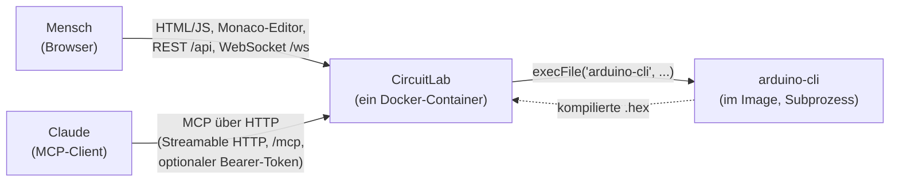
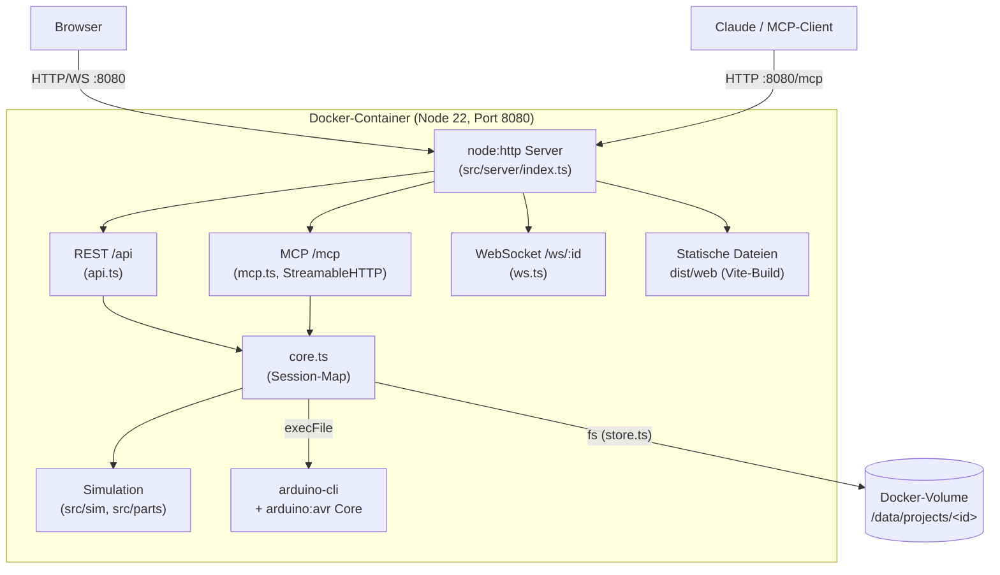
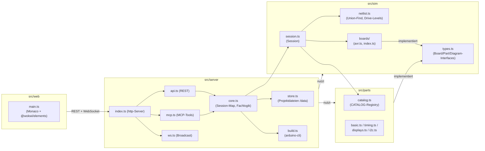
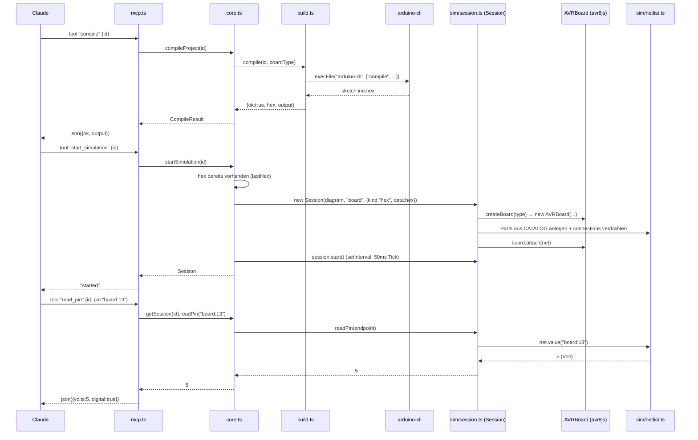
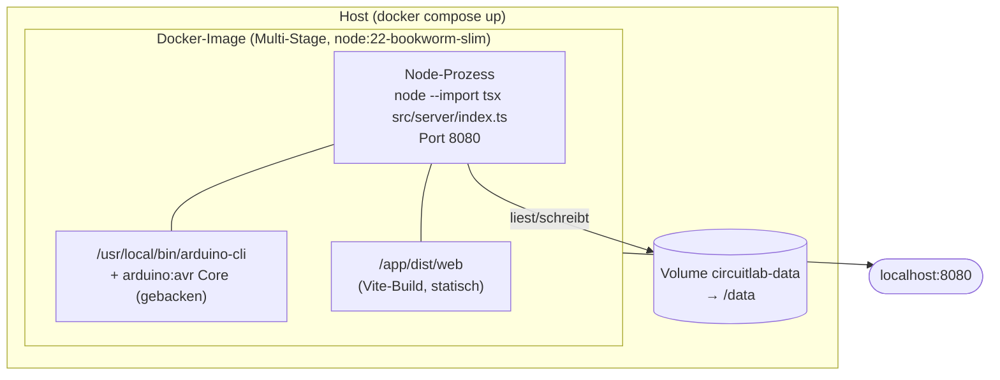

# CircuitLab — Architekturdokumentation (arc42)

Stand: Phase 1 (AVR end-to-end). Repo: `wökwi` / Paketname `circuitlab`.

## 1. Einführung und Ziele

CircuitLab ist ein selbst gehosteter Arduino-Simulator im Stil von Wokwi: Code-Editor,
Schaltplan, Live-Simulation und Serial Monitor in einem einzigen Docker-Container — und
zusätzlich ein MCP-Server, damit Claude Schaltungen bauen, kompilieren und testen kann, ohne
einen Browser zu benötigen. Auslöser war, dass Wokwi selbst Cloud-only ist, sein MCP-Zugang
einen Wokwi-Account/Token voraussetzt und der ESP32/STM32-Simulationskern nicht Open Source ist.

**Ziel:** ein eigener Nachbau, ein Container, Single-User ohne Login, Claude steuert alles über
MCP (HTTP) im selben Container wie der Browser-Client.

### Qualitätsziele (Top 5, priorisiert)

| # | Ziel | Erläuterung |
|---|------|--------------|
| 1 | **Maschinen-Bedienbarkeit (MCP)** | Jede Aktion, die die Web-UI kann, muss 1:1 als MCP-Tool existieren (`add_part`, `connect`, `compile`, `start_simulation`, `read_pin`, `set_control`, `screenshot`, …), damit Claude vollständig ohne Browser arbeiten kann. |
| 2 | **Simulationsgenauigkeit** | AVR-Kern ist echte Befehlssatz-Emulation (`avr8js`), keine Mock-Zustandsmaschine; Part-Verhalten wird aus Datenblättern hergeleitet (HD44780-Befehlssatz, SSD1306-Framebuffer, LDR-Gamma-Kurve, NTC-Beta-Formel …), nicht aus Wokwi-Quellcode kopiert. |
| 3 | **Betriebsarmut** | Ein Container, kein Login, keine externe Datenbank, kein Reverse Proxy erforderlich; `docker compose up` reicht. |
| 4 | **Lizenz-/Rechtssicherheit** | Nur MIT-lizenzierte Bibliotheken werden gebündelt/gelinkt; GPL-Werkzeuge (arduino-cli, avr-gcc) laufen ausschließlich als externer Subprozess; kein Wokwi-UI-Code, keine Wokwi-Texte, kein Wokwi-Branding. |
| 5 | **Erweiterbarkeit** | Neue Boards (`Board`-Interface) und neue Parts (`PartFactory`) sollen sich hinzufügen lassen, ohne bestehenden Code anzufassen (Registrierung nur über `CATALOG`/`AVR_VARIANTS`/`createBoard`). |

### Stakeholder

| Stakeholder | Erwartung |
|---|---|
| Aaron (Betreiber/einziger Nutzer) | Lokale Firmware-Entwicklung testen, ohne echte Hardware, ohne Cloud-Abhängigkeit. |
| Claude (via MCP) | Vollständige, deterministische Werkzeuge, um Schaltungen zu bauen, zu kompilieren, zu simulieren und Ergebnisse zu verifizieren (Pin-Spannung, Serial, Screenshot, Logic-Capture). |
| Zukünftige Mitwirkende an Sibling-Workstreams | Klare Erweiterungspunkte für RP2040/ESP32/STM32-Boards, Szenario-Runner, Library-Manager-UI, Diagramm-Editor. |

## 2. Randbedingungen

### Technische Randbedingungen

- **Sprache/Runtime:** TypeScript, Node.js ESM (`"type": "module"`), ausgeführt über `tsx`
  (kein separater Kompilierschritt für Server-Code — `node --import tsx src/server/index.ts`).
- **Ein Prozess, ein Container:** Web-UI (statisch), REST-API, WebSocket und MCP-Server laufen
  alle im selben Node-Prozess auf Port 8080 (`src/server/index.ts`).
- **Single-User, kein Login:** kein Auth-System außer optionalem Bearer-Token für `/mcp`
  (`MCP_TOKEN`). `/api` und die Web-UI sind komplett offen.
- **`arduino-cli` muss im Image vorhanden sein** (Dockerfile installiert Version v1.1.1 + Core
  `arduino:avr`), sonst schlagen `compile`/`start_simulation` fehl.
- **Persistenz nur für Projektdateien:** `/data/projects/<id>/{sketch/sketch.ino, diagram.json,
  libraries.txt}` auf einem Docker-Volume; laufende Simulationen sind ausschließlich In-Memory
  (`Map` in `core.ts`).

### Organisatorische / rechtliche Randbedingungen

- **Nur MIT-Abhängigkeiten werden reused/gebündelt:** `avr8js`, `rp2040js`, `@wokwi/elements`,
  `@modelcontextprotocol/sdk`, `intel-hex`, `pngjs`, `tsx`, `ws`, `zod` (MIT), `yaml` (ISC) — alle
  in `THIRD_PARTY_LICENSES.md` dokumentiert.
- **Kein Wokwi-Code, keine Wokwi-Assets, kein Wokwi-Branding.** Name bewusst „CircuitLab“, nicht
  „Wokwi“. Die Web-UI selbst, Doku-Texte, Beispielprojekte und der closed-source
  ESP32/STM32-Simulationskern von Wokwi wurden nicht übernommen.
- **`diagram.json` ist strukturell kompatibel zu Wokwis Format** (`type`/`id`/`top`/`left`/
  `attrs`, `connections` als `[from, to, color?, route?]`) — ausschließlich zur Interop
  (Import/Export), eigenständig reimplementiert (`src/sim/types.ts`), keine Wokwi-Texte
  übernommen.
- **GPL-Werkzeuge nur als externer Subprozess:** `arduino-cli` und die darüberliegende
  `avr-gcc`-Toolchain werden per `execFile` aufgerufen (`src/server/build.ts`), niemals in den
  eigenen Code eingebunden — siehe Kommentar im Dockerfile: *„GPL toolchains (avr-gcc etc.) run
  as a separate process via arduino-cli, never linked into this image's own code.“*
  Für die geplanten Boards gilt dasselbe Prinzip: QEMU (GPL) und Renode (MIT) sollen ebenfalls
  nur als Subprozesse angebunden werden.
- **Part-Verhalten wird aus Datenblättern selbst hergeleitet**, nicht aus Wokwis
  Simulator-Quellcode kopiert (z. B. HD44780-Befehlssatz in `src/parts/displays.ts`, LDR-Modell
  in `src/parts/basic.ts`).

## 3. Kontextabgrenzung

### Fachlicher Kontext

Zwei gleichberechtigte Akteure bedienen dieselbe laufende Simulation: ein menschlicher Nutzer
über den Browser und Claude über MCP. Beide sprechen letztlich mit derselben `Session`
(Abschnitt 5/8), sehen also konsistenten Zustand.



- **Nutzer ↔ CircuitLab:** Code bearbeiten (Monaco), Schaltplan als JSON bearbeiten
  (`diagram.json`-Textarea, kein Drag&Drop), Compile/Start/Stop klicken, Live-Zustand und
  Serial-Ausgabe über WebSocket beobachten.
- **Claude ↔ CircuitLab:** identische Fachlichkeit, aber über MCP-Tools (`create_project`,
  `add_part`, `connect`, `compile`, `start_simulation`, `read_pin`, `set_control`, `get_state`,
  `capture_logic`, `screenshot`, …) — vollständig ohne Browser nutzbar.
- **CircuitLab ↔ arduino-cli:** einziger externer Prozessaufruf; liefert eine `.hex`-Datei oder
  Compiler-Fehlermeldungen zurück.

### Technischer Kontext



Kein Zugriff nach außen erforderlich außer optional zum Nachladen von Arduino-Bibliotheken
(`arduino-cli lib install`, aus `libraries.txt`).

## 4. Lösungsstrategie

- **Simulation läuft serverseitig, nicht im Browser.** Dadurch sehen Nutzer und Claude dieselbe
  laufende Session gleichzeitig, und Claude kann vollständig headless arbeiten (kein Browser
  nötig, um eine Simulation zu starten oder einen Pin zu lesen).
- **Eine gemeinsame Business-Logik-Schicht (`core.ts`)** wird von REST-API (`api.ts`) und
  MCP-Tools (`mcp.ts`) gleichermaßen genutzt — keine Duplikation der Fachlogik zwischen den
  beiden Zugriffswegen.
- **Kein Web-Framework.** `node:http` direkt, ein Dutzend Routen in `api.ts`, `@modelcontextprotocol/sdk`
  nur für `/mcp`. Bewusst minimal, weil Single-User/Single-Container keine Middleware-Pipeline
  rechtfertigt.
- **Ein `Board`-Interface als einzige Hardware-Abstraktion**, weil mittelfristig mehrere echte
  Backends (AVR heute; RP2040/ESP32/STM32 geplant) dahinterstehen sollen, aber nur eines
  (`AVRBoard`) bereits implementiert ist.
- **Netlist als generischer Elektrik-Löser** (Union-Find über Drähte/Schalter, drei Treiberstufen
  strong/resistor/weak) statt eines Boards mit fest verdrahteten Pin-Paaren — jede Part-Factory
  registriert sich nur über Endpoint-Strings (`"partId:pin"`).
- **Datenblatt-getriebene Part-Modelle** statt Wokwi-Code-Wiederverwendung, sowohl aus
  rechtlichen Gründen als auch weil Wokwis Simulationskern für ESP32/STM32 closed source ist.

## 5. Bausteinsicht

### Ebene 1 — Whitebox Gesamtsystem



| Baustein | Verantwortung |
|---|---|
| `src/sim` | Elektrisches Modell (Netlist) und Board-Backends. Kennt keine HTTP-/MCP-Details. |
| `src/parts` | Ein Factory pro Bauteil, reagiert auf Netlist-Änderungen, implementiert `Part`. |
| `src/server` | Persistenz, Build, Session-Verwaltung, HTTP-/MCP-/WS-Schnittstellen. |
| `src/web` | Monaco-Editor + `@wokwi/elements` Web-Components als statische SPA, per Vite gebaut. |

### Ebene 2 — Whitebox `src/sim`

- **`types.ts`** definiert die zentralen Verträge: `Board`, `Part`, `PartFactory`, `SimContext`,
  `Diagram`/`DiagramPart`/`Connection`, `I2CDevice`, `SPIDevice`, `Firmware`. Jeder Board- oder
  Part-Baustein hängt nur von diesen Interfaces ab, nicht voneinander.
- **`netlist.ts`** (`Netlist`-Klasse): Union-Find über `"partId:pin"`-Endpunkte, Kanten aus
  Drähten (`connect`), Schaltern (`addSwitch`, bedingt geschlossen) und Widerständen
  (`addResistor`). Treiber haben drei Stufen — `STRONG` (Ausgänge/Versorgung) `>` `RESISTOR`
  (über einen Widerstand propagiert) `>` `WEAK` (interne Pull-ups) `>` floating (`null`/`NaN`).
  Konfligierende `STRONG`-Treiber auf demselben Netz setzen `net.short = true`.
- **`session.ts`** (`Session`-Klasse): verbindet genau ein `Board`, eine `Netlist` und eine
  `Map<string, Part>` zu einer laufenden Simulation. Baut beim Konstruieren aus einem `Diagram`
  alle Parts über `CATALOG` auf, verdrahtet `diagram.connections` in die Netlist und startet per
  `setInterval` einen 50-ms-Tick (`FRAME_MS`, ~20 Hz — der vertraglich zugesicherte Aufruftakt
  für `Part.frame()`).
- **`boards/avr.ts`** (`AVRBoard`): einzige heutige `Board`-Implementierung, kapselt `avr8js`
  (`CPU`, `AVRIOPort`, `AVRTimer`, `AVRUSART`, `AVRTWI`, `AVRSPI`, `AVRADC`, `AVRClock`,
  `AVREEPROM`, `AVRWatchdog`). Pin-Zuordnungen für Uno/Nano/Mega sind statische Tabellen
  (`UNO_PINS`, `MEGA_PINS`), Register-Interrupt-Vektoren werden für die Mega-Variante remappt.
- **`boards/index.ts`**: `createBoard(type, id, fw)` — Factory-Funktion, die anhand des Typs die
  passende Board-Klasse instanziiert; `FQBN`-Map für `arduino-cli`. Aktuell nur AVR-Zweig, wirft
  sonst einen Fehler (RP2040/ESP32/STM32 noch nicht angeschlossen, siehe Abschnitt 11).

### Ebene 2 — Whitebox `src/server`

- **`store.ts`**: reiner Dateisystem-Layer, `/data/projects/<id>/{sketch/sketch.ino,
  diagram.json, libraries.txt}`. Validiert Projekt-IDs per Regex gegen Path-Traversal. Legt beim
  Anlegen eines Projekts automatisch ein Blink-Sketch + Default-Diagram an.
- **`build.ts`**: ruft `arduino-cli compile`/`lib install` per `execFile` auf, liest die erzeugte
  `.hex` aus `build/`. Kennt keine Sessions, nur Dateien.
- **`core.ts`**: die zentrale Fachlogik-Schicht. Hält `sessions: Map<projectId, Session>` — **das
  ist der einzige globale veränderliche Zustand für laufende Simulationen**. Sowohl `api.ts` als
  auch `mcp.ts` rufen ausschließlich `core.ts`-Funktionen auf (`compileProject`,
  `startSimulation`, `stopSimulation`, `getSession`, `addPart`, `connect`, …); keine der beiden
  Schnittstellen enthält eigene Fachlogik. `core.onSessionStart` ist ein einfacher Hook-Array,
  über den sich `ws.ts` beim Sessionstart einklinkt, ohne dass `core.ts` von `ws.ts` wissen muss.
- **`api.ts`**: zustandslose REST-Fassade über `node:http` (kein Framework), parst
  `url.pathname` manuell in Segmente, delegiert an `core.ts`, fängt Fehler zu HTTP 400 mit
  `{error}`-JSON.
- **`mcp.ts`**: registriert die MCP-Tools über `@modelcontextprotocol/sdk`, Eingaben mit `zod`
  validiert. Jeder Tool-Call ist mit `guard()` umschlossen, das Exceptions in
  `{isError: true, content: [...]}` übersetzt statt den Prozess/die Transport-Session
  abzureißen. Ruft dieselben `core.ts`-Funktionen auf wie `api.ts`.
- **`ws.ts`**: hält `clientsByProject: Map<projectId, Set<WebSocket>>`, abonniert
  `session.onState`/`session.onSerial` über den `onSessionStart`-Hook und broadcastet JSON an
  alle Browser-Clients desselben Projekts.
- **`index.ts`**: erstellt den `node:http`-Server, routet `/mcp` (mit optionalem
  Bearer-Token-Check gegen `MCP_TOKEN`), `/api/*` (an `api.ts`), `/ws/*` (Upgrade an `ws.ts`) und
  liefert sonst statische Dateien aus `dist/web` (SPA-Fallback auf `index.html`). Verwaltet
  `mcpSessions: Map<sessionId, StreamableHTTPServerTransport>` — ein MCP-Server+Transport-Paar
  pro Client-Session.

## 6. Laufzeitsicht

### 6.1 Claude kompiliert, startet eine Simulation und liest einen Pin (über MCP)



Wichtige Details entlang dieses Pfads:

- `core.compileProject` und `core.startSimulation` lesen den Boardtyp aus `diagram.json`
  (`d.parts.find(p => p.id === 'board')`) — die Konvention „ein Part mit `id: 'board'`“ ist
  implizit, nicht typgeprüft.
- `startSimulation` kompiliert nur neu, wenn keine `.hex` aus einem vorherigen Build existiert
  (`lastHex()`); sonst wird die zuletzt kompilierte Firmware wiederverwendet.
- Innerhalb von `new Session(...)` läuft der komplette Aufbau (`net.batch(...)`) gebündelt, damit
  Netlist-Listener nicht auf jede einzelne Verbindung während des Aufbaus reagieren.

### 6.2 Browser bearbeitet Code und beobachtet eine blinkende LED über WebSocket

```mermaid
sequenceDiagram
    participant Browser
    participant Monaco
    participant api as api.ts
    participant core as core.ts
    participant Session as sim/session.ts (Session)
    participant LED as parts/basic.ts (led)
    participant ws as ws.ts

    Monaco->>api: PUT /api/projects/:id/file?name=sketch/sketch.ino (debounced 500ms)
    api->>core: store.writeFile(id, name, content)

    Browser->>api: POST /api/projects/:id/compile
    api->>core: compileProject(id)
    core-->>api: {ok:true}

    Browser->>api: POST /api/projects/:id/start
    api->>core: startSimulation(id)
    core->>Session: new Session(...) inkl. led-Part via CATALOG
    core->>ws: onSessionStart-Hooks feuern
    ws->>Session: session.onState = broadcast; session.onSerial = broadcast

    loop alle 50ms (FRAME_MS)
        Session->>Session: board.run(50ms) (avr8js führt Instruktionen aus)
        Note over Session,LED: AVRBoard.attach() treibt Pin-Spannung in die Netlist,<br/>led-Part hört per net.listen auf A/C und akkumuliert Duty-Cycle
        Session->>LED: part.frame()
        LED-->>Session: state() → {value, brightness}
        Session->>ws: onState({ledId: {value, brightness}, ...})
        ws->>Browser: WS-Message {type:"state", states:{...}}
        Browser->>Browser: applyState() setzt Properties auf wokwi-led-Element
    end
```

Wichtige Details:

- Der Browser bekommt Live-Zustand ausschließlich über den WebSocket-Push (`ws.ts`), nicht durch
  Polling; Claude dagegen nutzt Polling-artige MCP-Tools (`get_state`, `read_pin`) — beide Wege
  laufen aber auf **derselben** `Session`-Instanz zusammen, sind also konsistent.
- Die LED-Helligkeit ist kein Digitalwert, sondern ein PWM-Tastgrad (`Duty`-Klasse in
  `parts/util.ts`), der pro Tick zwischen zwei `frame()`-Aufrufen gemittelt wird — deshalb ist
  `frame()` (20 Hz) getrennt von der eigentlichen Spannungsreaktion (`net.listen`, so oft wie
  Übergänge passieren).

## 7. Verteilungssicht



- **Build-Stage:** installiert alle npm-Abhängigkeiten (`npm ci`), baut die Web-UI mit Vite
  (`vite build` → `dist/web`). Diese Stage wird nicht ins Laufzeit-Image übernommen.
- **Runtime-Stage:** frisches `node:22-bookworm-slim`; installiert `arduino-cli` v1.1.1 per
  Installationsskript und den `arduino:avr`-Core direkt im Image (`RUN arduino-cli core install
  arduino:avr`), danach `apt-get purge curl` — die AVR-Toolchain ist also **fest ins Image
  gebacken**, kein Download zur Laufzeit nötig. `npm ci --omit=dev` installiert nur
  Produktionsabhängigkeiten.
- **In das Image kopiert wird nur Quellcode** (`src/server`, `src/sim`, `src/parts` als `.ts`,
  ausgeführt über `tsx` — kein Kompilierschritt für den Server) plus der fertige `dist/web`
  aus der Build-Stage.
- **Volume `/data`** ist der einzige persistente Zustand: Projektverzeichnisse
  (`sketch/sketch.ino`, `diagram.json`, `libraries.txt`, kompilierte `.hex` unter `build/`).
  Laufende Simulationen (`Session`-Objekte) leben ausschließlich im Node-Heap und überleben
  einen Container-Neustart **nicht**.
- **Ports:** nur 8080 exponiert, bedient HTTP-API, WebSocket-Upgrades und `/mcp` gleichzeitig.
- **Umgebungsvariablen:** `DATA_DIR` (Default `/data`), `PORT` (Default `8080`), `MCP_TOKEN`
  (leer = kein Auth-Schutz auf `/mcp`).
- **docker-compose.yml** definiert genau einen Service, ein Volume, einen Port — keine weiteren
  Container (keine DB, kein Reverse Proxy, kein separater Worker-Prozess für die Simulation).

## 8. Querschnittliche Konzepte

### Netlist-Modell (Drive-Level)

Jeder Endpunkt (`"partId:pin"`) gehört über Union-Find zu einer Netzgruppe. Treiber
(`net.drive(endpoint, {v, strong})`) haben drei Stufen, höchste gewinnt:

1. **`STRONG`** (3) — aktive Ausgänge, Versorgungsspannung (`GND`, `5V`, …).
2. **`RESISTOR`** (2) — über einen Widerstand von einer `STRONG`-Quelle abgeleitet, iterativ
   propagiert (`compute()` läuft mehrfach über die Widerstandsliste, bis sich nichts mehr
   ändert, maximal `resistors.length`-mal).
3. **`WEAK`** (1) — interne Pull-ups (z. B. `INPUT_PULLUP` am AVR).
4. **floating** — kein Treiber auf dieser Stufe → `NaN`.

Konfligierende `STRONG`-Treiber mit unterschiedlichem Pegel auf demselben Netz setzen
`net.short = true` und lassen (dokumentiertes Verhalten, kein Crash) den niedrigeren Pegel
gewinnen — das bildet grob nach, dass ein Kurzschluss real eher Richtung Low zieht, ersetzt aber
keine echte Stromberechnung.

### Part-Interface-Vertrag

`Part` (in `types.ts`) hat ausschließlich optionale Hooks — jede Part-Factory implementiert nur,
was sie braucht:

- `state()` — Properties, die 1:1 auf das `@wokwi/elements`-Custom-Element im Browser gemappt
  werden (`Object.assign(el, state)` in `main.ts`).
- `control(name, value)` — Nutzer-/Automations-Input (Button drücken, Poti drehen, Sensorwert
  setzen); wird sowohl vom Browser-Klick-Handler als auch vom MCP-Tool `set_control` aufgerufen.
- `frame()` — Aufruf im festen 20-Hz-Tick der `Session`, für Mittelwertbildung (PWM-Helligkeit
  über `Duty`).
- `framebuffer()` — für Displays (SSD1306, ILI9341, HD44780), liefert RGBA-Rohdaten für
  `Session.screenshot()` (PNG-Encoding über `pngjs`).
- `i2c`/`spi` — optionale Peripherie-Geräte, die sich über `Board.addI2C`/`addSPI` am Board
  registrieren.

### Board-Interface-Vertrag

Jedes Board (aktuell nur `AVRBoard`) muss `nowNs()`, `schedule(fn, delayNs)`, `run(ms)`,
`serialWrite`/`onSerial`, `addI2C`/`addSPI`, `attach(net)` und `stop()` implementieren, plus die
Liste seiner Pin-Namen (`pins`) und optionale I2C-/SPI-Pin-Namen. Das optionale `async`-Flag ist
für künftige Boards vorgesehen, deren Firmware asynchron bootet (z. B. MicroPython auf RP2040) —
heute ungenutzt, da nur AVR existiert.

### Fehlerbehandlungs-Konventionen

- **MCP (`mcp.ts`):** jeder Tool-Handler läuft durch `guard()`, das jede Exception in
  `{isError: true, content: [...]}` übersetzt, statt die Transport-Session abzureißen.
- **REST (`api.ts`):** ein zentraler `try/catch` um das gesamte Routing, Fehler werden zu
  HTTP 400 mit `{error: message}`.
- **Store (`store.ts`):** Projekt-IDs werden per Regex validiert (`/^[a-zA-Z0-9_-]+$/`), um
  Path-Traversal über die Dateisystem-API zu verhindern.
- **Kompilierfehler sind kein Exception-Pfad:** `compile` liefert immer `{ok, output}` zurück,
  auch bei Fehlschlag — Caller (Claude oder Browser) müssen `ok` explizit prüfen.

### MCP-Session-Lebenszyklus

`index.ts` hält `mcpSessions: Map<sessionId, StreamableHTTPServerTransport>`. Für jede neue
`mcp-session-id` wird ein frisches `McpServer` (`createMcpServer()`) samt Transport angelegt;
`onsessioninitialized`/`onsessionclosed` pflegen die Map. Kommentar im Code begründet das
explizit: *„Claude Code reconnecting after a restart needs a fresh session, not 'already
initialized' forever.“* Der optionale Bearer-Token-Check (`MCP_TOKEN`) sitzt in `index.ts` vor
dem eigentlichen MCP-Handling, nicht im SDK selbst.

### Lizenz-/Copyright-Ansatz

Siehe Abschnitt 2 — als Querschnittskonzept relevant, weil es jede neue Abhängigkeit und jeden
neuen Part/Board betrifft: MIT-Check vor jeder neuen Dependency, Eintrag in
`THIRD_PARTY_LICENSES.md`, GPL-Werkzeuge nur als Subprozess, Part-/Board-Verhalten aus
Datenblättern, nicht aus Wokwi-Quellcode.

## 9. Architekturentscheidungen (ADRs)

| # | Entscheidung | Begründung | Konsequenz |
|---|---|---|---|
| 1 | **Simulation läuft serverseitig, nicht im Browser** | Claude braucht headless Zugriff ohne Browser; Nutzer und Claude sollen dieselbe Session sehen. | Server-Ressourcen tragen die CPU-Emulation; Browser ist nur noch Editor + Live-Ansicht. |
| 2 | **`node:http` statt Web-Framework** (kein Express/Hono/Fastify) | Single-User, ~15 Routen, keine Middleware-Pipeline nötig — minimale Abhängigkeitsfläche. | `api.ts` parst Pfade manuell; jede neue Route ist ein manueller `if`-Zweig. |
| 3 | **`avr8js` in-process statt Worker-Thread/Subprozess** | Für AVR reicht Instruktionsemulation in JS, Overhead eines Worker-Threads/IPC wäre unnötig. | Eine lange CPU-Schleife (`board.run`) blockiert den Event-Loop kurzzeitig pro Tick (50 ms Budget). |
| 4 | **RP2040/ESP32/STM32 geplant über echte Emulatoren als Subprozess** (`rp2040js` in-process wie AVR; ESP32 via QEMU-Subprozess, STM32 via Renode-Subprozess) statt eigener Nachbau der Kerne | ESP32/STM32-Kerne selbst nachzubilden wäre unrealistisch; QEMU/Renode sind vorhandene, geeignet lizenzierte Emulatoren. | Bringt eine noch fehlende GPIO-/UART-Bridge zwischen Subprozess und `Netlist` mit sich (größtes offenes Risiko, siehe Abschnitt 11). |
| 5 | **`diagram.json` strukturell kompatibel zu Wokwi, aber eigenständig reimplementiert** | Interop (bestehende Diagramme importierbar) ohne Wokwi-Code/-Texte zu übernehmen. | `types.ts`/`store.ts` müssen das Format eigenständig pflegen, auch wenn sich Wokwis Format ändert. |
| 6 | **Ein `Session` pro Projekt, rein In-Memory, keine Persistenz laufenden Zustands** | Einfachheit; Projektdateien (Code/Diagramm) sind ohnehin die Quelle der Wahrheit, der Simulationszustand ist reproduzierbar (neu kompilieren + starten). | Serverneustart verliert jede laufende Simulation ersatzlos (siehe Risiko in Abschnitt 11). |
| 7 | **Gemeinsame Fachlogik-Schicht `core.ts`** statt Logik direkt in `api.ts`/`mcp.ts` | REST und MCP sollen exakt dieselben Operationen anbieten, ohne Duplikation. | Jede neue Fähigkeit muss in `core.ts` landen, dann in beiden Schnittstellen nur noch verdrahtet werden. |
| 8 | **`tsx` als Laufzeit statt vorkompiliertem JS für den Server** | Kein separater Build-Schritt für Backend-Code, `npm run dev` und Produktion nutzen denselben Mechanismus. | Leichter Laufzeit-Overhead durch On-the-fly-Transpilierung; kein eigenständiges `dist/server`. |
| 9 | **Volle Netlist-Neuberechnung bei jeder Änderung** statt inkrementellem Dependency-Graph | Einfachheit, für die realistische Bauteilanzahl (<1000 Endpunkte) ausreichend performant. | Dokumentiert als bewusste Vereinfachung (`ponytail`-Kommentar in `netlist.ts:4`), Skalierungsgrenze bekannt. |

## 10. Qualitätsanforderungen

### Qualitätsbaum (Auszug)

```
Qualität
├─ Funktionale Korrektheit
│   ├─ Elektrisches Modell (Drive-Levels, Kurzschluss-Erkennung)
│   └─ Bauteil-Treue zu Datenblättern (HD44780, SSD1306, DHT22, LDR, NTC, …)
├─ Bedienbarkeit
│   ├─ Für Menschen (Web-UI: Monaco, Live-WS-Ansicht)
│   └─ Für Claude (MCP: 1:1-Deckung mit REST-Fähigkeiten)
├─ Betriebsarmut
│   ├─ Ein Container, ein Prozess
│   └─ Keine externe Datenbank/kein Reverse Proxy nötig
├─ Erweiterbarkeit
│   ├─ Neues Board = neue `Board`-Implementierung + Eintrag in `createBoard`/`FQBN`
│   └─ Neuer Part = neue `PartFactory` + Eintrag in `CATALOG`
└─ Rechtssicherheit
    ├─ Nur MIT-Abhängigkeiten gebündelt
    └─ GPL-Werkzeuge nur als Subprozess
```

### Qualitätsszenarien

| Szenario | Erwartetes Verhalten | Wo im Code |
|---|---|---|
| Claude ruft `read_pin` für einen unbeschalteten Pin auf. | Liefert `{volts: NaN, digital: null}`, kein Fehler/Crash. | `Netlist.value()` gibt `NaN` bei floating zurück; `mcp.ts` mappt das explizit auf `digital: null`. |
| Zwei starke Treiber (z. B. zwei Ausgänge) landen auf demselben Netz. | Simulation läuft weiter, `net.short` wird gesetzt, niedrigerer Pegel gewinnt (kein Absturz). | `Netlist.compute()`, getestet in `test/netlist.test.ts`. |
| `arduino-cli compile` schlägt wegen Syntaxfehler fehl. | `compile`-Tool/-Route liefert `{ok:false, output: "<Compiler-Meldung>"}`, wirft keine Exception. | `build.ts` fängt den `execFile`-Fehler ab und gibt `output` zurück statt zu werfen. |
| Browser und Claude sind gleichzeitig mit demselben Projekt verbunden. | Beide sehen konsistenten Zustand, weil beide dieselbe `Session`-Instanz in `core.ts` ansprechen. | `sessions`-Map in `core.ts`, gemeinsam von `api.ts` und `mcp.ts` genutzt. |
| Der Server wird neu gestartet, während eine Simulation läuft. | Laufender Zustand geht verloren; Projektdateien (Code, Diagramm, zuletzt kompilierte `.hex`) bleiben erhalten; ein erneuter `start_simulation`-Aufruf baut die Simulation neu auf. | `sessions`-Map ist reiner Heap-Zustand; `store.ts`/`build.ts` schreiben auf das Volume. |
| Jemand exponiert `/mcp` versehentlich ohne `MCP_TOKEN` im Internet. | Kein eingebauter Schutz — jeder mit Netzwerkzugriff kann alle MCP-Tools aufrufen. | `index.ts` prüft `Authorization`-Header nur, wenn `MCP_TOKEN` gesetzt ist (siehe Risiko in Abschnitt 11). |

## 11. Risiken und technische Schulden

### Größtes offenes Risiko: ESP32/STM32-Peripherie-Bridge

`src/sim/boards/index.ts` unterstützt heute ausschließlich AVR-Boards; der Aufruf für jeden
anderen Typ wirft explizit:

```ts
// ponytail: rp2040/esp32/stm32 backends not implemented yet, see plan phases 3-5
throw new Error(`Board type "${type}" not supported yet (planned: rp2040, esp32, stm32)`);
```

Laut Plan (`~/.claude/plans/informiere-dich-ber-die-cheeky-treehouse.md`) sollen ESP32/STM32 über
QEMU- bzw. Renode-**Subprozesse** laufen. Der noch nicht gelöste Teil ist die **GPIO-/I2C-Bridge
zwischen Subprozess und der bestehenden `Netlist`** — weder QEMUs qtest-Protokoll noch Renodes
Monitor-Sockets sind an einen In-Process-`Netlist.drive()`/`listen()`-Mechanismus wie bei AVR
angebunden. Der Plan nennt das selbst als größten Restaufwand und fordert vorab einen
1–2-tägigen Spike. RP2040 läuft zwar wie `avr8js` in-process (keine Subprozess-Bridge nötig) und
ist damit *architektonisch* risikoärmer, hat sich aber bei näherer Prüfung als eigener Aufwand
herausgestellt: `rp2040js` braucht das reale RP2040-Bootrom (BSD-3-Clause, verfügbar über
`wokwi/rp2040js`, kein Blocker), aber das einzige über `@wokwi/elements` darstellbare RP2040-Board
(Nano RP2040 Connect) hat `Serial` standardmäßig auf USB-CDC statt UART — das bräuchte eine eigene
Bridge zwischen `RPUSBController` und der Serial-API, plus den Multicore-Boot-Handshake des
`arduino-pico`-Cores über SIO-FIFO. Nicht mit vergleichbarer Sicherheit verifizierbar wie der
Hand-Assembler-Test für AVR (`test/avr.test.ts`) in vertretbarem Aufwand — bewusst zurückgestellt,
um keine halbfunktionierende Board-Unterstützung als fertig auszugeben.

### Dokumentierte bewusste Abkürzungen (`ponytail:`-Kommentare)

| Datei:Zeile | Abkürzung | Grenze / Upgrade-Pfad |
|---|---|---|
| `src/sim/netlist.ts:4` | Volle Netzwert-Neuberechnung bei jeder Änderung. | Passt für <1000 Endpunkte; bei großen Schaltungen müsste auf inkrementelle Aktualisierung umgestellt werden. |
| `src/sim/boards/avr.ts:50` | Beim Mega sind A8–A15 nur digital nutzbar; der ADC-MUX5-Kanalbereich ist nicht verdrahtet. | Analoglesungen auf A8–A15 liefern keinen sinnvollen Wert; MUX5-Bit müsste im ADC-Modell ergänzt werden. |
| `src/sim/boards/avr.ts:118` | Beim Mega ist nur PCINT0 (Port B) verdrahtet, keine externen `INTn`-Interrupts. | Pin-Change-Interrupts auf Port A/C/J/K und externe Interrupts (`INT0`–`INT7`) funktionieren auf dem Mega nicht. |
| `src/parts/displays.ts:191` | ILI9341-MADCTL-Rotation behandelt nur `MV` (Zeilen/Spalten-Tausch, Landscape). | Volle 4-Wege-Rotation (inkl. gespiegelter Modi) fehlt. |
| `src/parts/timing.ts:141` | HX711: Gain-/Kanal-Pulse 25–27 werden alle wie Gain 128 behandelt. | Kanal B / Gain 32 wird nicht unterschieden. |
| `src/sim/boards/index.ts:15` | RP2040/ESP32/STM32-Boards nicht implementiert (siehe oben). | Größtes offenes Risiko, s. o. |

### Weitere Risiken / technische Schulden

- **Ein In-Memory-`Session` pro Projekt, keine Persistenz laufenden Zustands.** Ein
  Server-/Container-Neustart verliert jede laufende Simulation vollständig; nur Projektdateien
  auf dem Volume überleben. Es gibt keinen Mechanismus, laufende Sessions nach einem Neustart
  automatisch wiederherzustellen.
- **Keine Authentifizierung außer optionalem `MCP_TOKEN` auf `/mcp`.** `/api` und die Web-UI sind
  komplett offen; für Single-User/localhost akzeptabel, aber gefährlich, sobald der Port über
  `localhost` hinaus exponiert wird (Doku warnt davor im README, technisch aber nicht
  erzwungen).
- **Dünne Testabdeckung.** Nur `test/netlist.test.ts` (Drive-Level-Logik) und `test/avr.test.ts`
  (ein Smoke-Test mit handgeschriebenem Maschinencode) existieren. Die ~35 Part-Implementierungen
  (`displays.ts`, `i2c.ts`, `timing.ts`, der Großteil von `basic.ts`) haben keine automatisierten
  Tests — Regressionen in Datenblatt-Verhalten würden nicht auffallen.
- **Kein Szenario-Runner, keine Library-Manager-UI, kein Drag&Drop-Diagramm-Editor.** Laut README
  („Not yet built“) und Plan (Phase 2) fehlen: YAML-Testszenarien, eine UI für
  `libraries.txt`/`arduino-cli lib install`, und ein visueller Schaltplan-Editor — Verdrahtung
  läuft heute ausschließlich über MCP-Tools oder direktes Editieren von `diagram.json` in einer
  Textarea.
- **Einzelner Node-Prozess ohne horizontale Skalierung.** Eine lange CPU-Emulationsschleife
  (`AVRBoard.run()`) blockiert kurzzeitig den Event-Loop; bei vielen gleichzeitig laufenden
  Projekten in einem Container konkurrieren alle Sessions um denselben Thread.
- **Implizite Konvention statt Typprüfung:** `core.ts` geht davon aus, dass jedes Diagramm genau
  einen Part mit `id: 'board'` enthält (`boardType()`); ein falsch benanntes/fehlendes Board-Part
  führt erst zur Laufzeit zu einem Fehler, nicht beim Schreiben des Diagramms.

## 12. Glossar

| Begriff | Bedeutung |
|---|---|
| **Netlist** | Elektrisches Modell in `src/sim/netlist.ts`: verbindet Endpunkte (`"partId:pin"`) per Union-Find zu Netzgruppen und löst deren Spannung anhand von Treiberstufen (strong/resistor/weak) auf. |
| **Drive-Level** | Priorität eines Spannungstreibers auf einem Netz: `STRONG` (Ausgang/Versorgung) > `RESISTOR` (über Widerstand abgeleitet) > `WEAK` (Pull-up) > floating (`NaN`). Bestimmt, welcher Treiber „gewinnt“ und ob ein Kurzschluss (`net.short`) erkannt wird. |
| **Part** | Ein Bauteil-Modell (`src/parts/*.ts`), erzeugt durch eine `PartFactory` aus einem `DiagramPart`. Implementiert optionale Hooks: `state()`, `control()`, `frame()`, `framebuffer()`, `i2c`/`spi`. |
| **Board** | Die Hardware-Abstraktion (`src/sim/types.ts`, `Board`-Interface) für eine konkrete MCU. Heute nur `AVRBoard` (avr8js) implementiert; RP2040/ESP32/STM32 sind geplant. |
| **Diagram** | Die Schaltplan-Beschreibung eines Projekts (`diagram.json`): Liste von `DiagramPart`s (Typ, Position, Attribute) und `Connection`s (`[from, to, color?, route?]`). Strukturell kompatibel zu Wokwis Format, eigenständig implementiert. |
| **Session** | `src/sim/session.ts`, `Session`-Klasse: eine laufende Simulation, bestehend aus genau einer `Netlist`, einem `Board` und einer `Map<string, Part>`. Pro Projekt existiert höchstens eine `Session` gleichzeitig (verwaltet in `core.ts`), rein In-Memory. |
| **MCP** | Model Context Protocol — der Zugangsweg, über den Claude CircuitLab ohne Browser steuert (`/mcp`, Streamable HTTP, implementiert in `src/server/mcp.ts` über `@modelcontextprotocol/sdk`). |
| **FQBN** | Fully Qualified Board Name — Arduino-CLI-Kennung für einen Board-Typ (z. B. `arduino:avr:uno`), Mapping in `src/sim/boards/index.ts`. |
| **CATALOG** | Die Registry aller Part-Factories nach Diagramm-Typ-String (`src/parts/catalog.ts`), von `Session` beim Aufbau einer Simulation genutzt. |
